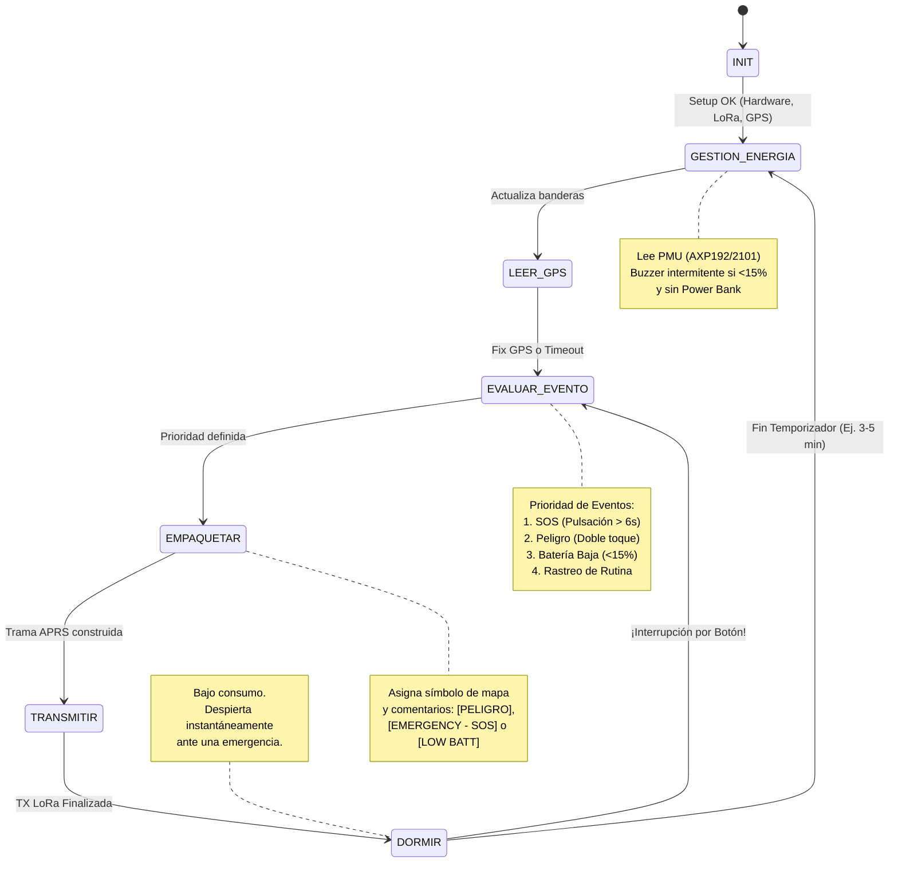
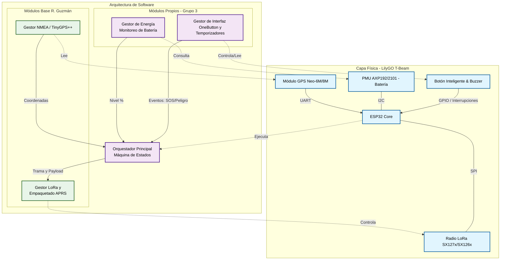

# Taller Integrador: Grupo 3

**Proyecto: Sistema de Monitoreo LoRa para Áreas de Conservación y Parques Nacionales**

**La problemática**

En áreas de conservación, ya sea con topografía montañosa y de alta densidad forestal (como los senderos al rededor del cráter del Volcán Poás) o en extensos humedales navegables (como la reserva de Caño Negro), la cobertura celular tradicional es nula o altamente intermitente. Esta desconexión representa un riesgo significativo para la seguridad de los guardaparques durante sus patrullajes, dificulta la coordinación de guías que lideran grupos de estudiantes o turistas, y limita el monitoreo en tiempo real de embarcaciones enfocadas en el control ambiental y la pesca. 

**La solución propuesta (El tracker)**

Desarrollar un nodo rastreador LoRa APRS portátil, de bajo consumo y alta autonomía. Este dispositivo actuará como una baliza versátil que puede ser llevada en una mochila por un guía terrestre o instalada temporalmente en un bote. Al transmitir la posición mediante radiofrecuencia a un iGate central (ubicado en la casetas o muelles principales), la administración del parque obtiene telemetría en tiempo real sin depender de redes comerciales de telecomunicaciones. 

**Máquina de estados**

A continuación se muestra el diagrama de máquina de estados propuesto para la implementación y desarrollo de este proyecto. En el diagrama se detallan los eventos y lo esperado de cada estado. 



**Diagrama de Firmware por implementar**

Este diagrama de bloques muestra la forma en la que se relacionan los componentes físicos del Hardware con los módulos de código. A continuación se detalla la propuesta del diagrama. Los bloques del sistema se dividen en dos capas: 
*Capa del Hardware:*
- ESP32 (Microcontrolador Core):Este es el cerebro del LilyGO- T-Beam
- Módulo LoRa (SPI): Chip para transmisión de radiofrecuencia.
- Módulo GPS (UART): Receptor de posicionamiento satelital.
- PMU AXP192/2101 (I2C): Chip de gestión de energía (batería 18650).
- Interfaz de Usuario (GPIO): Botones y el buzzer.

*Capa de Firmware*
- Core / Main Loop: El orquestador principal, es decir la máquina de estados.
- Gestor APRS / LoRa: Se encarga de codificar el texto al estándar APRS y manejar las librerías del radio.
- Gestor GPS: Extrae latitud, longitud y hora usando librerías como TinyGPS++.
- Gestor de Energía: Se comunicará por I2C con el chip AXP para leer el porcentaje de batería.
- Gestor de Interfaz: Manejará la librería ```OneButton``` para los toques del usuario y la lógica no bloqueante (temporizador) del buzzer.


