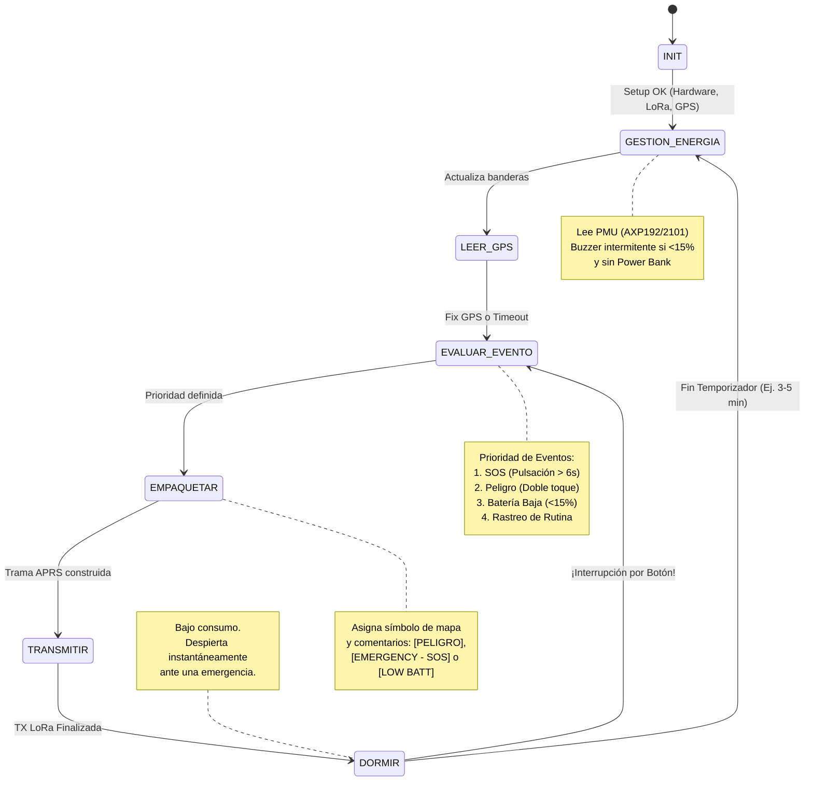

# Taller Integrador: Grupo 3

**Proyecto: Sistema de Monitoreo LoRa para Áreas de Conservación y Parques Nacionales**

**La problemática**

En áreas de conservación, ya sea con topografía montañosa y de alta densidad forestal (como los senderos al rededor del cráter del Volcán Poás) o en extensos humedales navegables (como la reserva de Caño Negro), la cobertura celular tradicional es nula o altamente intermitente. Esta desconexión representa un riesgo significativo para la seguridad de los guardaparques durante sus patrullajes, dificulta la coordinación de guías que lideran grupos de estudiantes o turistas, y limita el monitoreo en tiempo real de embarcaciones enfocadas en el control ambiental y la pesca. 

**La solución propuesta (El tracker)**

Desarrollar un nodo rastreador LoRa APRS portátil, de bajo consumo y alta autonomía. Este dispositivo actuará como una baliza versátil que puede ser llevada en una mochila por un guía terrestre o instalada temporalmente en un bote. Al transmitir la posición mediante radiofrecuencia a un iGate central (ubicado en la casetas o muelles principales), la administración del parque obtiene telemetría en tiempo real sin depender de redes comerciales de telecomunicaciones. 

**Máquina de estados**

A continuación se muestra el diagrama de máquina de estados propuesto para la implementación y desarrollo de este proyecto. En el diagrama se detallan los eventos y lo esperado de cada estado. 



**Diagrama de Firmware por implementar**

Este diagrama de bloques muestra la forma en la que se relacionan los componentes físicos del Hardware con los módulos de código. A continuación se detalla la propuesta del diagrama. Los bloques del sistema se dividen en dos capas: 
*Capa del Hardware:*
- ESP32 (Microcontrolador Core):Este es el cerebro del LilyGO- T-Beam
- Módulo LoRa (SPI): Chip para transmisión de radiofrecuencia.
- Módulo GPS (UART): Receptor de posicionamiento satelital.
- PMU AXP192/2101 (I2C): Chip de gestión de energía (batería 18650).
- Interfaz de Usuario (GPIO): Botones y el buzzer.

*Capa de Firmware*
- Core / Main Loop: El orquestador principal, es decir la máquina de estados.
- Gestor APRS / LoRa: Se encarga de codificar el texto al estándar APRS y manejar las librerías del radio.
- Gestor GPS: Extrae latitud, longitud y hora usando librerías como TinyGPS++.
- Gestor de Energía: Se comunicará por I2C con el chip AXP para leer el porcentaje de batería.
- Gestor de Interfaz: Manejará la librería ```OneButton``` para los toques del usuario y la lógica no bloqueante (temporizador) del buzzer.


**Pseudocódigo**

En esta sección se detalla la lógica de control y las transiciones. Para la implementación de la arquitectura que diseñamos, la estructura principal se basará en una máquina de estados finitos (FSM) controlada por una instrucción ```switch-case``` dentro del ciclo principal, esta estructura estará apoyada en variables globales que actuarán como banderas (flags) de eventos

*1. Definición de variables globales y estados*
```
// Definición de los estados posibles
ENUMERADOR EstadosTracker:
    INIT
    GESTION_ENERGIA
    LEER_GPS
    EVALUAR_EVENTO
    EMPAQUETAR
    TRANSMITIR
    DORMIR

// Estado inicial
Variable estado_actual = INIT

// Banderas de eventos (Modificadas por hardware o interrupciones)
Booleano bandera_sos = FALSO
Booleano bandera_peligro = FALSO
Booleano bandera_bateria_baja = FALSO

// Tiempos y contadores
Entero tiempo_dormir_ms = 180000 // 3 minutos
Entero temporizador_actual = 0
```
*2. Funciones de Interrupción (Callbacks del botón)*
```
// Esta función se dispara automáticamente si la librería OneButton detecta doble clic
FUNCION evento_doble_clic():
    bandera_peligro = VERDADERO
    // Forzamos la salida del estado de reposo
    estado_actual = EVALUAR_EVENTO 
FIN FUNCION

// Esta función se dispara si se mantiene presionado el botón por 6 segundos
FUNCION evento_pulsacion_larga():
    bandera_sos = VERDADERO
    // Forzamos la salida del estado de reposo
    estado_actual = EVALUAR_EVENTO
FIN FUNCION
```
*3. Ciclo Principal (Main Loop)*
```
FUNCION INICIO_PROGRAMA (Setup):
    Configurar Puerto Serial
    Inicializar Módulo LoRa (Frecuencia, SF, BW)
    Inicializar Módulo GPS (Baud rate)
    Inicializar Chip PMU AXP (Gestión de energía)
    
    // Configurar el botón y vincular los eventos
    BotonInteligente.asignarDobleClic(evento_doble_clic)
    BotonInteligente.asignarPulsacionLarga(evento_pulsacion_larga)
    
    Configurar Pin Buzzer como SALIDA
FIN FUNCION


FUNCION CICLO_INFINITO (Loop):
    // Siempre debemos escuchar al botón en cada iteración del ciclo
    BotonInteligente.actualizar() 

    EVALUAR (estado_actual):
    
        CASO INIT:
            SI hardware_inicializado_correctamente:
                estado_actual = GESTION_ENERGIA
            SINO:
                Imprimir "Error de Hardware"
                Reiniciar_Dispositivo()
            FIN SI
        FIN CASO

        CASO GESTION_ENERGIA:
            NivelBateria = Leer_PMU_AXP()
            ConectadoUSB = Leer_PMU_USB_Estado()
            
            SI NivelBateria < 15% Y ConectadoUSB == FALSO:
                bandera_bateria_baja = VERDADERO
                Activar_Buzzer_Intermitente() // Lógica no bloqueante con millis()
            SINO:
                bandera_bateria_baja = FALSO
                Apagar_Buzzer()
            FIN SI
            
            estado_actual = LEER_GPS
        FIN CASO

        CASO LEER_GPS:
            Iniciar_Temporizador_Timeout_GPS(2 minutos)
            
            MIENTRAS (GPS_No_Tenga_Fix Y No_Haya_Timeout):
                Leer_Datos_Puerto_Serial_GPS()
                
                // Si despertamos por SOS, no queremos esperar 2 minutos
                SI bandera_sos == VERDADERO Y Tenemos_Coordenada_Anterior:
                    ROMPER_MIENTRAS // Salimos rápido para enviar la alerta
                FIN SI
            FIN MIENTRAS
            
            Guardar_Ultimas_Coordenadas_Validas()
            estado_actual = EVALUAR_EVENTO
        FIN CASO

        CASO EVALUAR_EVENTO:
            // Lógica de prioridades (Si hay varias banderas, gana la más crítica)
            SI bandera_sos == VERDADERO:
                Tipo_Mensaje_Actual = "EMERGENCIA_SOS"
            SINO SI bandera_peligro == VERDADERO:
                Tipo_Mensaje_Actual = "ALERTA_PELIGRO"
            SINO SI bandera_bateria_baja == VERDADERO:
                Tipo_Mensaje_Actual = "RUTINA_BATERIA_BAJA"
            SINO:
                Tipo_Mensaje_Actual = "RUTINA_NORMAL"
            FIN SI
            
            estado_actual = EMPAQUETAR
        FIN CASO

        CASO EMPAQUETAR:
            Cadena_APRS = Construir_Encabezado()
            Cadena_APRS += Agregar_Latitud_Longitud()
            
            SI Tipo_Mensaje_Actual == "EMERGENCIA_SOS":
                Cadena_APRS += Cambiar_Simbolo_Mapa("Cruz Roja")
                Cadena_APRS += "[EMERGENCY - SOS]"
            SINO SI Tipo_Mensaje_Actual == "ALERTA_PELIGRO":
                Cadena_APRS += "[PELIGRO - ASISTENCIA]"
            ... // Misma lógica para batería baja o normal
            
            estado_actual = TRANSMITIR
        FIN CASO

        CASO TRANSMITIR:
            Encender_Radio_LoRa()
            Enviar_Paquete(Cadena_APRS)
            Esperar_Confirmacion_Transmision()
            Apagar_Radio_LoRa() // Ahorro de energía
            
            // Limpiar banderas críticas después de enviarlas exitosamente
            bandera_sos = FALSO
            bandera_peligro = FALSO
            
            temporizador_actual = Obtener_Tiempo_Actual()
            estado_actual = DORMIR
        FIN CASO

        CASO DORMIR:
            // Espera NO bloqueante para permitir que el botón siga siendo escuchado
            SI (Obtener_Tiempo_Actual() - temporizador_actual >= tiempo_dormir_ms):
                estado_actual = GESTION_ENERGIA // Inicia ciclo de rutina nuevo
            FIN SI
            
            // Nota: Si se presiona el botón durante este tiempo, 
            // las funciones de interrupción (arriba) cambiarán el estado_actual 
            // a EVALUAR_EVENTO inmediatamente, rompiendo este letargo.
        FIN CASO
        
    FIN EVALUAR
FIN FUNCION
``` 
